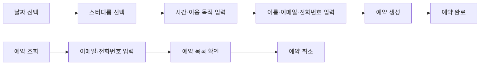
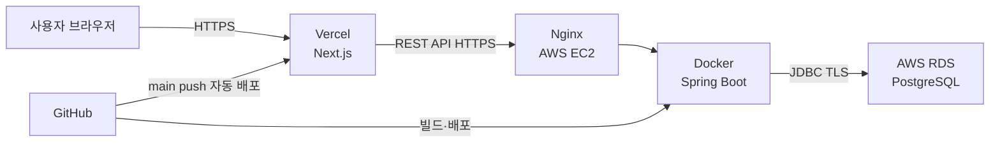
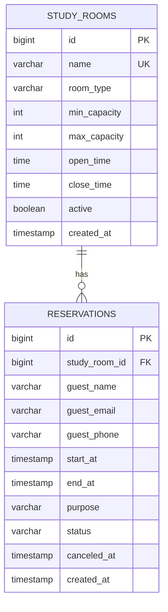
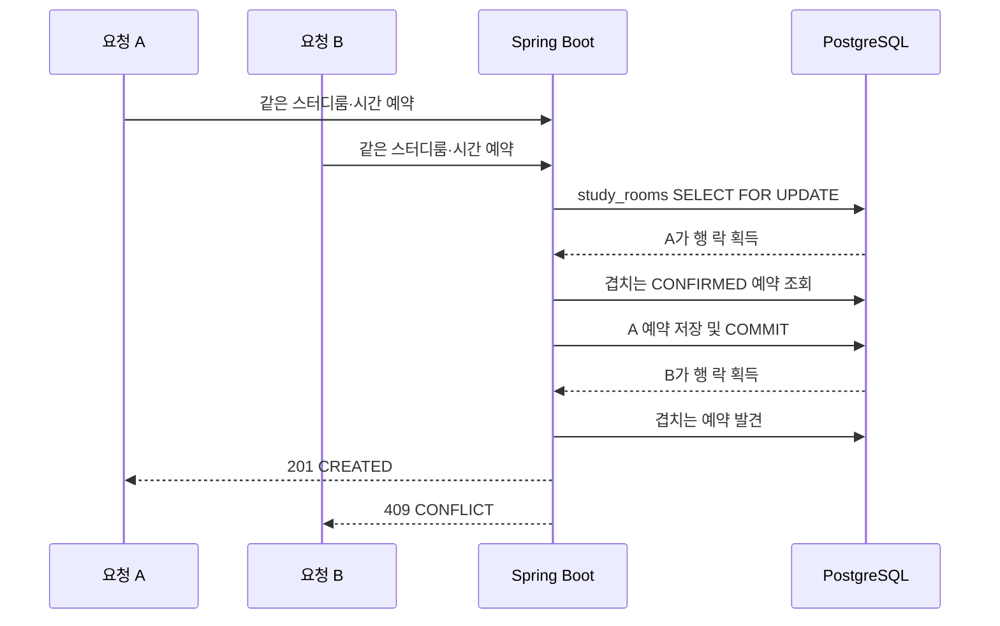

# 📐 StudyOn Backend

스터디룸 예약 서비스의 백엔드 서버입니다. 비회원이 이름·이메일·전화번호를 입력해 빠르게 예약하고, 동시성 제어를 통해 중복 예약 없이 안전하게 처리하는 것을 목표로 합니다.

<br>

## 🖥️ 기술 스택

<table>
<tr>
<td valign="top" width="50%">

**Backend**


**Database**


</td>
<td valign="top" width="50%">

**Infra / DevOps (배포 예정)**


**Frontend (연동)**


</td>
</tr>
</table>

<br>

## 🚀 서비스 소개

- 날짜·스터디룸·시간을 선택해 **비회원**으로 빠르게 예약합니다.
- 이메일·전화번호가 모두 일치하면 본인의 예약 목록을 조회하고 취소할 수 있습니다.
- 이미 예약된 시간은 선택할 수 없고, 동시 요청이 발생해도 **한 건만 성공**합니다.

**제공 공간**

| 구분 | 내용 |
|---|---|
| 룸 타입 | 4인실 · 6인실 · 8인실 · 10인실 (4가지) |
| 룸 수 | 타입별 3개씩, 총 **12개** |
| 운영시간 | 06:00 ~ 23:00 |

**예약 정책**

- 1시간 단위, 최소 1시간 ~ 최대 4시간까지 예약 가능
- 이미 예약된 시간대는 예약 불가
- 예약 수정 미지원 → 변경 시 취소 후 재예약
- 이용 목적은 50자 이내
- 예약 취소는 삭제가 아닌 상태값 `CANCELED`로 변경

<br>

## 🧭 사용자 흐름



<br>

## 🏗️ 배포 목표 아키텍처



<br>

## 🗂️ ERD



### `study_rooms`

| 컬럼 | 타입 | 제약 및 설명 |
|---|---|---|
| `id` | BIGINT | PK, identity |
| `name` | VARCHAR(50) | NOT NULL, UNIQUE. 예: 4인 1호실 |
| `room_type` | VARCHAR(20) | NOT NULL. `ROOM_4`, `ROOM_6`, `ROOM_8`, `ROOM_10` |
| `min_capacity` | INTEGER | NOT NULL, 1 이상 |
| `max_capacity` | INTEGER | NOT NULL, 최소 인원 이상 |
| `open_time` | TIME | NOT NULL, 기본 06:00 |
| `close_time` | TIME | NOT NULL, 기본 23:00 |
| `active` | BOOLEAN | NOT NULL, 현재 운영 여부 |
| `created_at` | TIMESTAMP | NOT NULL, 생성 시각 |

### `reservations`

| 컬럼 | 타입 | 제약 및 설명 |
|---|---|---|
| `id` | BIGINT | PK, identity |
| `study_room_id` | BIGINT | NOT NULL, `study_rooms.id` FK |
| `guest_name` | VARCHAR(50) | NOT NULL |
| `guest_email` | VARCHAR(255) | NOT NULL, 소문자로 정규화 |
| `guest_phone` | VARCHAR(20) | NOT NULL, 숫자만 저장 |
| `start_at` | TIMESTAMP | NOT NULL, 예약 시작 시각 |
| `end_at` | TIMESTAMP | NOT NULL, 예약 종료 시각 |
| `purpose` | VARCHAR(50) | NOT NULL, 최대 50자 |
| `status` | VARCHAR(20) | NOT NULL, `CONFIRMED` 또는 `CANCELED` |
| `canceled_at` | TIMESTAMP | NULL 가능, 취소 시각 |
| `created_at` | TIMESTAMP | NOT NULL, 생성 시각 |

**DB 제약조건 / 인덱스**

- `CHECK (min_capacity > 0 AND max_capacity >= min_capacity)`
- `CHECK (start_at < end_at)`
- `CHECK (char_length(purpose) BETWEEN 1 AND 50)`
- `CHECK (status IN ('CONFIRMED', 'CANCELED'))`
- 시간 조회 인덱스: `(study_room_id, status, start_at)`
- 비회원 조회 인덱스: `(guest_email, guest_phone, created_at DESC)`

> 날짜·시간 컬럼은 PostgreSQL `TIMESTAMP`, Java에서는 `LocalDateTime`을 사용합니다.

<br>

## ⚙️ 동시성 설계

같은 스터디룸·시간대에 대한 동시 예약 요청이 들어와도 하나만 성공하도록, 비관적 락(`PESSIMISTIC_WRITE`) 기반으로 처리합니다.



- 예약 생성 서비스 메서드 전체에 `@Transactional`을 적용합니다.
- 대상 `study_rooms` 행을 JPA `PESSIMISTIC_WRITE`로 조회합니다.
- 락을 얻은 뒤 겹치는 확정 예약을 다시 조회합니다.
- 충돌이 없을 때만 저장하고, 충돌하면 `409 Conflict`를 반환합니다.
- 동시성 테스트는 같은 요청을 다수 전송해 성공 1건, 충돌 N-1건인지 확인합니다.

**중복 예약 판정 조건**

```
existing.start_at < requested.end_at
AND existing.end_at > requested.start_at
AND existing.status = 'CONFIRMED'
```

<br>

## 🔌 API 설계

| Method | 경로 | 설명 |
|---|---|---|
| GET | `/api/v1/study-rooms` | 운영 중인 스터디룸 목록 조회 |
| GET | `/api/v1/study-rooms/{id}/availability?date=YYYY-MM-DD` | 날짜별 예약 가능 시간 조회 |
| POST | `/api/v1/reservations` | 비회원 예약 생성 |
| GET | `/api/v1/reservations?guestEmail={email}&guestPhone={phone}` | 이메일·전화번호로 예약 목록 조회 |
| PATCH | `/api/v1/reservations/{reservationId}/cancel` | 예약자 정보 재확인 후 예약 취소 |

**요청·응답 원칙**

- 비회원 예약 조회는 이메일·전화번호를 쿼리 파라미터로 전달합니다.
- 예약 취소 요청에도 이메일·전화번호를 받아 예약자 정보를 다시 확인합니다.
- 예약 생성 성공은 `201 Created`, 조회·취소 성공은 `200 OK`를 반환합니다.
- 예약 생성 응답에는 `reservationId`를 포함합니다.

**오류 코드**

| HTTP 상태 | 사용 시점 |
|---|---|
| 400 Bad Request | 운영시간, 이용시간, 연락처 등 입력값이 정책을 위반함 |
| 404 Not Found | 스터디룸 또는 예약을 찾을 수 없음 |
| 409 Conflict | 예약 시간 중복 또는 이미 취소된 예약 |

<br>

## 📁 프로젝트 구조

```
studyon-backend
├── db
│   └── schema.sql
├── src
│   ├── main
│   │   ├── java/com/studyon/studyon
│   │   │   ├── common/exception
│   │   │   ├── controller
│   │   │   ├── domain
│   │   │   ├── dto
│   │   │   ├── repository
│   │   │   └── service
│   │   └── resources
│   │       └── application.yml
│   └── test
│       └── java/com/studyon/studyon
├── .env
├── .gitignore
├── build.gradle
└── settings.gradle
```
