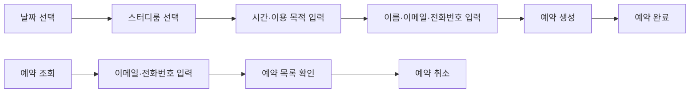
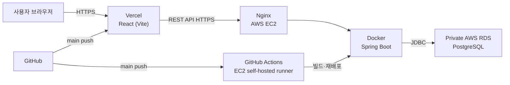
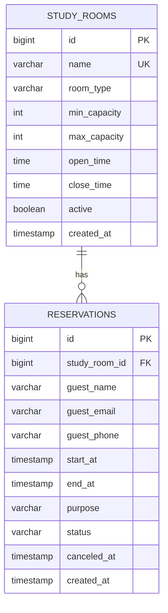
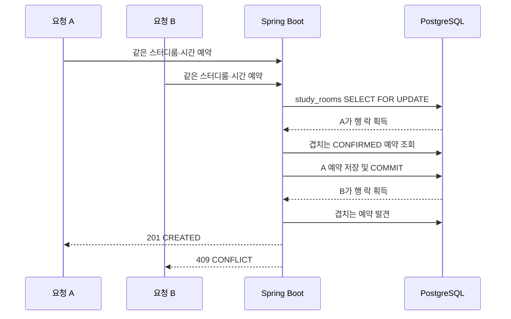
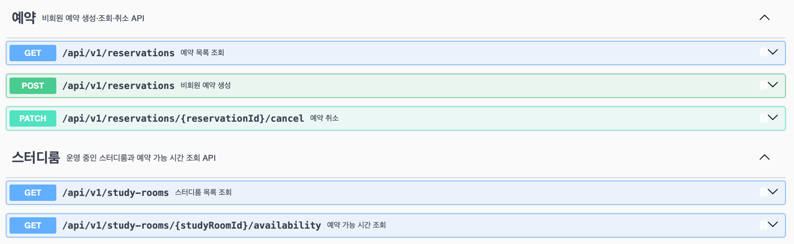

#   👩‍💻 StudyOn Backend

스터디룸 예약 서비스의 백엔드 서버입니다. 비회원이 이름·이메일·전화번호를 입력해 빠르게 예약하고, 동시성 제어를 통해 중복 예약 없이 안전하게 처리하는 것을 목표로 합니다.

<br>

## 🖥️ 기술 스택

<table>
<tr>
<td valign="top" width="50%">

**Backend**


**Database**


</td>
<td valign="top" width="50%">

**Infra / DevOps**


**Frontend (연동)**


</td>
</tr>
</table>

<br>

## 🔗 배포 링크

| 구분 | 주소 |
|---|---|
| StudyOn | [studyon-frontend.vercel.app](https://studyon-frontend.vercel.app) |

<br>

## 🚀 서비스 소개

- 날짜·스터디룸·시간을 선택해 **비회원**으로 빠르게 예약합니다.
- 이메일·전화번호가 모두 일치하면 본인의 예약 목록을 조회하고 취소할 수 있습니다.
- 이미 예약된 시간은 선택할 수 없고, 동시 요청이 발생해도 **한 건만 성공**합니다.

**제공 공간**

| 구분 | 내용 |
|---|---|
| 룸 타입 | 4인실 · 6인실 · 8인실 · 10인실 (4가지) |
| 룸 수 | 타입별 3개씩, 총 **12개** |
| 운영시간 | 06:00 ~ 23:00 |

**예약 정책**

- 1시간 단위, 최소 1시간 ~ 최대 4시간까지 예약 가능
- 이미 예약된 시간대는 예약 불가
- 예약 수정 미지원 → 변경 시 취소 후 재예약
- 이용 목적은 50자 이내
- 예약 취소는 시작 1시간 전까지 가능하며, 삭제 대신 상태값을 `CANCELED`로 변경

<br>

## 🧭 사용자 흐름



<br>

## 🏗️ 배포 아키텍처



- Nginx가 외부 HTTPS 요청을 EC2 내부의 Spring Boot 컨테이너(`127.0.0.1:8080`)로 전달합니다.
- RDS는 퍼블릭 접근을 허용하지 않고, EC2 보안 그룹에서만 PostgreSQL 포트 접근을 허용합니다.
- `main`에 push하면 Vercel은 프론트를, GitHub Actions self-hosted runner는 백엔드 Docker 컨테이너를 자동 배포합니다.
- DB 접속 정보는 Git에 포함하지 않고, EC2의 별도 `.env` 파일로 관리합니다.

<br>

## 🗂️ ERD



### `study_rooms`

| 컬럼 | 타입 | 제약 및 설명 |
|---|---|---|
| `id` | BIGINT | PK, identity |
| `name` | VARCHAR(50) | NOT NULL, UNIQUE. 예: 4인 1호실 |
| `room_type` | VARCHAR(20) | NOT NULL. `ROOM_4`, `ROOM_6`, `ROOM_8`, `ROOM_10` |
| `min_capacity` | INTEGER | NOT NULL, 1 이상 |
| `max_capacity` | INTEGER | NOT NULL, 최소 인원 이상 |
| `open_time` | TIME | NOT NULL, 기본 06:00 |
| `close_time` | TIME | NOT NULL, 기본 23:00 |
| `active` | BOOLEAN | NOT NULL, 현재 운영 여부 |
| `created_at` | TIMESTAMP | NOT NULL, 생성 시각 |

### `reservations`

| 컬럼 | 타입 | 제약 및 설명 |
|---|---|---|
| `id` | BIGINT | PK, identity |
| `study_room_id` | BIGINT | NOT NULL, `study_rooms.id` FK |
| `guest_name` | VARCHAR(50) | NOT NULL |
| `guest_email` | VARCHAR(255) | NOT NULL, 소문자로 정규화 |
| `guest_phone` | VARCHAR(20) | NOT NULL, 숫자만 저장 |
| `start_at` | TIMESTAMP | NOT NULL, 예약 시작 시각 |
| `end_at` | TIMESTAMP | NOT NULL, 예약 종료 시각 |
| `purpose` | VARCHAR(50) | NOT NULL, 최대 50자 |
| `status` | VARCHAR(20) | NOT NULL, `CONFIRMED` 또는 `CANCELED` |
| `canceled_at` | TIMESTAMP | NULL 가능, 취소 시각 |
| `created_at` | TIMESTAMP | NOT NULL, 생성 시각 |

**DB 제약조건 / 인덱스**

- `CHECK (min_capacity > 0 AND max_capacity >= min_capacity)`
- `CHECK (start_at < end_at)`
- `CHECK (char_length(purpose) BETWEEN 1 AND 50)`
- `CHECK (status IN ('CONFIRMED', 'CANCELED'))`
- 시간 조회 인덱스: `(study_room_id, status, start_at)`
- 비회원 조회 인덱스: `(guest_email, guest_phone, created_at DESC)`

> 날짜·시간 컬럼은 PostgreSQL `TIMESTAMP`, Java에서는 `LocalDateTime`을 사용합니다.

<br>

## ⚙️ 동시성 설계

같은 스터디룸·시간대에 대한 동시 예약 요청이 들어와도 하나만 성공하도록, 비관적 락(`PESSIMISTIC_WRITE`) 기반으로 처리합니다. 낙관적 락은 별도 브랜치에서 성능 비교를 위해 실험했습니다.



- 예약 생성 서비스 메서드 전체에 `@Transactional`을 적용합니다.
- 대상 `study_rooms` 행을 JPA `PESSIMISTIC_WRITE`로 조회합니다.
- 락을 얻은 뒤 겹치는 확정 예약을 다시 조회하고, 충돌하면 `409 Conflict`를 반환합니다.
- PostgreSQL 배타 제약(`EXCLUDE USING gist`)도 적용해 DB 레벨에서 겹치는 확정 예약을 최종 차단합니다.
- 동시성 테스트는 락 방식의 효과만 비교할 수 있도록 배타 제약을 적용하지 않은 별도 테스트 DB에서 실행했습니다.
- 동시성 테스트는 같은 스터디룸·시간대 요청을 다수 전송해 성공 1건, 충돌 N-1건인지 확인합니다.

**중복 예약 판정 조건**

```
existing.start_at < requested.end_at
AND existing.end_at > requested.start_at
AND existing.status = 'CONFIRMED'
```

<br>

## 🔌 API 명세

| Method | 경로 | 설명 |
|---|---|---|
| GET | `/api/v1/study-rooms` | 운영 중인 스터디룸 목록 조회 |
| GET | `/api/v1/study-rooms/{studyRoomId}/availability?date=YYYY-MM-DD` | 날짜별 예약 가능 시간 조회 |
| POST | `/api/v1/reservations` | 비회원 예약 생성 |
| GET | `/api/v1/reservations?guestEmail={email}&guestPhone={phone}` | 이메일·전화번호로 예약 목록 조회 |
| PATCH | `/api/v1/reservations/{reservationId}/cancel` | 예약자 정보 확인 후 예약 취소 |



### 공통 규칙

- 모든 응답은 아래 공통 형식으로 반환합니다. HTTP 상태 코드는 응답 헤더에서 확인합니다.
- 성공 응답의 `code`는 항상 `SUCCESS`이며, 실제 DTO 또는 DTO 목록은 `data`에 담깁니다.
- 오류 응답의 `data`는 `null`이며, `code`로 오류 종류를 구분합니다.
- 비회원 예약 조회는 이메일·전화번호를 쿼리 파라미터로 전달합니다. 이메일은 앞뒤 공백을 제거하고 소문자로, 전화번호는 숫자만 남겨 조회합니다.
- 예약 시간은 `YYYY-MM-DDTHH:mm:ss`, 날짜는 `YYYY-MM-DD` 형식입니다.

### 오류 응답

```json
{
  "code": "RESERVATION_CONFLICT",
  "message": "이미 예약된 시간대입니다. 다른 시간을 선택해주세요.",
  "data": null
}
```

| HTTP 상태 | 응답 코드 | 사용 시점 |
|---|---|---|
| 400 Bad Request | `VALIDATION_ERROR`, `INVALID_DATE`, `INVALID_RESERVATION`, `RESERVATION_VERIFICATION_FAILED`, `RESERVATION_CANCELLATION_NOT_ALLOWED` | DTO 검증, 날짜·운영시간·이용시간 정책 위반 또는 예약자 정보 불일치 |
| 404 Not Found | `STUDY_ROOM_NOT_FOUND`, `RESERVATION_NOT_FOUND` | 스터디룸 또는 예약을 찾을 수 없음 |
| 409 Conflict | `RESERVATION_CONFLICT` | 예약 시간 중복 |

### 상세 명세

#### 스터디룸 목록 조회

`GET /api/v1/study-rooms`

운영 중인 `active=true` 스터디룸 목록을 반환합니다. 요청 body와 query parameter는 없습니다.

```json
{
  "code": "SUCCESS",
  "message": "요청에 성공했습니다.",
  "data": [
    {
      "id": 1,
      "name": "4인 1호실",
      "roomType": "ROOM_4",
      "minCapacity": 1,
      "maxCapacity": 4,
      "openTime": "06:00:00",
      "closeTime": "23:00:00"
    }
  ]
}
```

#### 예약 가능 시간 조회

`GET /api/v1/study-rooms/{studyRoomId}/availability?date=YYYY-MM-DD`

| 이름 | 위치 | 타입 | 필수 | 설명 |
|---|---|---|---|---|
| `studyRoomId` | Path | Long | Y | 스터디룸 ID |
| `date` | Query | LocalDate | Y | 오늘부터 3개월 이내의 조회 날짜 |

현재보다 이전 시간의 슬롯 또는 확정 예약과 겹치는 슬롯은 `available=false`로 반환합니다.

```json
{
  "code": "SUCCESS",
  "message": "요청에 성공했습니다.",
  "data": {
    "studyRoomId": 1,
    "date": "2026-09-08",
    "slots": [
      { "startTime": "06:00", "endTime": "07:00", "available": true },
      { "startTime": "07:00", "endTime": "08:00", "available": false }
    ]
  }
}
```

#### 예약 생성

`POST /api/v1/reservations`

```json
{
  "studyRoomId": 1,
  "guestName": "홍길동",
  "guestEmail": "guest@example.com",
  "guestPhone": "010-1234-5678",
  "startAt": "2026-09-08T10:00:00",
  "endAt": "2026-09-08T12:00:00",
  "purpose": "팀 프로젝트 회의"
}
```

| 필드 | 타입 | 필수 | 검증 |
|---|---|---|---|
| `studyRoomId` | Long | Y | 양수이며 운영 중인 스터디룸 |
| `guestName` | String | Y | 공백 제외, 최대 50자 |
| `guestEmail` | String | Y | 이메일 형식, 최대 255자 |
| `guestPhone` | String | Y | 숫자와 하이픈만 허용, 숫자 기준 10~11자리 |
| `startAt`, `endAt` | LocalDateTime | Y | 같은 날짜의 정각, 1~4시간, 운영시간 안 |
| `purpose` | String | Y | 공백 제외 1~50자 |

- 시작 시각은 현재 이후이고, 예약 날짜는 오늘부터 3개월 이내여야 합니다.
- `CONFIRMED` 상태 예약과 시간이 겹치면 생성할 수 없습니다.
- 중복 판정: `existing.startAt < requested.endAt AND existing.endAt > requested.startAt`

**응답: `201 Created`**

```json
{
  "code": "SUCCESS",
  "message": "요청에 성공했습니다.",
  "data": {
    "reservationId": 101,
    "studyRoomId": 1,
    "studyRoomName": "4인 1호실",
    "guestName": "홍길동",
    "guestEmail": "guest@example.com",
    "guestPhone": "01012345678",
    "startAt": "2026-09-08T10:00:00",
    "endAt": "2026-09-08T12:00:00",
    "purpose": "팀 프로젝트 회의",
    "status": "CONFIRMED"
  }
}
```

#### 예약 목록 조회

`GET /api/v1/reservations?guestEmail={email}&guestPhone={phone}`

| 이름 | 위치 | 타입 | 필수 | 설명 |
|---|---|---|---|---|
| `guestEmail` | Query | String | Y | 이메일 형식 |
| `guestPhone` | Query | String | Y | 숫자와 하이픈만 허용 |

이메일과 전화번호가 모두 일치하는 예약을 생성 시각 내림차순으로 반환하며, 일치하는 예약이 없으면 빈 배열을 반환합니다.

```json
{
  "code": "SUCCESS",
  "message": "요청에 성공했습니다.",
  "data": [
    {
      "reservationId": 101,
      "studyRoomId": 1,
      "studyRoomName": "4인 1호실",
      "startAt": "2026-09-08T10:00:00",
      "endAt": "2026-09-08T12:00:00",
      "purpose": "팀 프로젝트 회의",
      "status": "CONFIRMED",
      "canceledAt": null,
      "createdAt": "2026-09-07T14:00:00"
    }
  ]
}
```

#### 예약 취소

`PATCH /api/v1/reservations/{reservationId}/cancel`

```json
{
  "guestEmail": "guest@example.com",
  "guestPhone": "010-1234-5678"
}
```

| 이름 | 위치 | 타입 | 필수 | 설명 |
|---|---|---|---|---|
| `reservationId` | Path | Long | Y | 예약 ID |
| `guestEmail` | Body | String | Y | 예약자 확인용 이메일 |
| `guestPhone` | Body | String | Y | 예약자 확인용 전화번호 |

```json
{
  "code": "SUCCESS",
  "message": "요청에 성공했습니다.",
  "data": {
    "reservationId": 101,
    "status": "CANCELED",
    "canceledAt": "2026-09-07T14:30:00"
  }
}
```

예약은 삭제하지 않고 `CANCELED` 상태로 변경합니다. 이미 취소된 예약을 다시 요청해도 현재 상태를 반환합니다.
예약 시작 1시간 이내에는 취소할 수 없습니다.

<br>

## 🧪 테스트

- 단위 테스트: 예약 생성·조회·취소 정책과 스터디룸 조회를 검증합니다.
- 통합 테스트: MockMvc 기반으로 예약·스터디룸 API의 요청과 응답을 검증합니다.
- 동시성 테스트: 비관적 락에서 같은 시간대 요청 중 성공 1건, 충돌 N-1건을 검증합니다.
- 부하 테스트: k6로 100 VU 동시 예약 시나리오를 3회 실행해 결과를 비교했습니다.
- 배포 환경 검증: AWS EC2·Nginx·RDS 경로에서 비관적 락으로 100 VU를 실행해 성공 1건, 충돌 99건, 예상 밖 오류 0건을 확인했습니다.

자세한 결과는 [동시성 테스트 문서](docs/performance/reservation-concurrency.md), [락 방식 비교 문서](docs/performance/reservation-lock-comparison.md)에서 확인할 수 있습니다.

<br>

## 📁 프로젝트 구조

```
studyon-backend
├── .github
│   └── workflows
│       └── deploy.yml
├── .dockerignore
├── db
│   ├── schema.sql
│   └── study_rooms_data.sql
├── docs
│   └── performance
├── src
│   ├── main
│   │   ├── java/com/studyon/studyon
│   │   │   ├── common/exception
│   │   │   ├── controller
│   │   │   ├── domain
│   │   │   ├── dto
│   │   │   ├── repository
│   │   │   └── service
│   │   └── resources
│   │       └── application.yml
│   └── test
│       └── java/com/studyon/studyon
├── tests
│   └── k6
├── Dockerfile
├── .gitignore
├── build.gradle
└── settings.gradle
```
